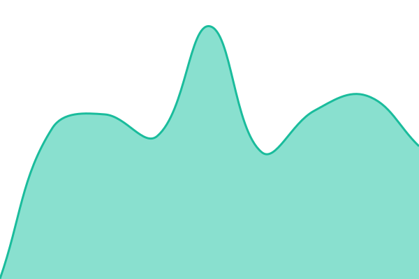
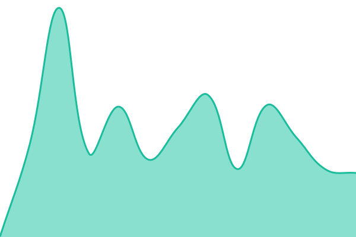
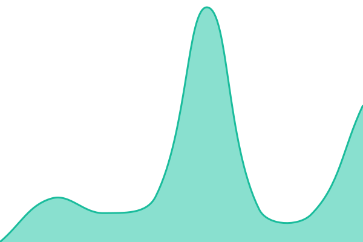

# [📈 Live Status](https://fonoempresa.github.io/upptime): <!--live status--> **🟧 Partial outage**

This repository contains the open-source uptime monitor and status page for [fonoempresa](https://fonoempresa.github.io/upptime), powered by [Upptime](https://github.com/upptime/upptime).

With [Upptime](https://upptime.js.org), you can get your own unlimited and free uptime monitor and status page, powered entirely by a GitHub repository. We use [Issues](https://github.com/fonoempresa/upptime/issues) as incident reports, [Actions](https://github.com/fonoempresa/upptime/actions) as uptime monitors, and [Pages](https://fonoempresa.github.io/upptime) for the status page.

<!--start: status pages-->
<!-- This summary is generated by Upptime (https://github.com/upptime/upptime) -->
<!-- Do not edit this manually, your changes will be overwritten -->
<!-- prettier-ignore -->
| URL | Status | History | Response Time | Uptime |
| --- | ------ | ------- | ------------- | ------ |
|  [Shop FONOTRIP](https://shop.fonotrip.com) | 🟥 Down | [shop-fonotrip.yml](https://github.com/fonoempresa/upptime/commits/HEAD/history/shop-fonotrip.yml) | 

 508ms
     
 | 

<a href="https://status.siligom.net/history/shop-fonotrip">23.31%</a>
    

|  [Fonoempresa](https://fonoempresa.com) | 🟩 Up | [fonoempresa.yml](https://github.com/fonoempresa/upptime/commits/HEAD/history/fonoempresa.yml) | 

 945ms
     
 | 

<a href="https://status.siligom.net/history/fonoempresa">100.00%</a>
    

|  [Fonotrip](https://fonotrip.com) | 🟩 Up | [fonotrip.yml](https://github.com/fonoempresa/upptime/commits/HEAD/history/fonotrip.yml) | 

 467ms
     
 | 

<a href="https://status.siligom.net/history/fonotrip">100.00%</a>
    

|  [WAF FONOTRIP](https://www.fonotrip.com) | 🟩 Up | [waf-fonotrip.yml](https://github.com/fonoempresa/upptime/commits/HEAD/history/waf-fonotrip.yml) | 

 640ms
     
 | 

<a href="https://status.siligom.net/history/waf-fonotrip">100.00%</a>
    

|  [Periba](http://www.periba.com.ar) | 🟩 Up | [periba.yml](https://github.com/fonoempresa/upptime/commits/HEAD/history/periba.yml) | 

 554ms
     
 | 

<a href="https://status.siligom.net/history/periba">100.00%</a>
    

|  [Magnustech](https://www.magnustech.net) | 🟩 Up | [magnustech.yml](https://github.com/fonoempresa/upptime/commits/HEAD/history/magnustech.yml) | 

 213ms
     
 | 

<a href="https://status.siligom.net/history/magnustech">100.00%</a>
    

|  [MSGG2](https://msggw2.fonoempresa.com) | 🟥 Down | [msgg-2.yml](https://github.com/fonoempresa/upptime/commits/HEAD/history/msgg-2.yml) | 

 303ms
     
 | 

<a href="https://status.siligom.net/history/msgg-2">17.43%</a>
    

|  [API2CALL](https://api2call.fonoempresa.com) | 🟥 Down | [api-2-call.yml](https://github.com/fonoempresa/upptime/commits/HEAD/history/api-2-call.yml) | 

 281ms
     
 | 

<a href="https://status.siligom.net/history/api-2-call">17.77%</a>
    

|  [CDN](https://cdn.phloxnetworks.com/IMG_2857.webp) | 🟩 Up | [cdn.yml](https://github.com/fonoempresa/upptime/commits/HEAD/history/cdn.yml) | 

 350ms
     
 | 

<a href="https://status.siligom.net/history/cdn">100.00%</a>
    

|  [Helpdesk Magnustech](https://helpdesk.magnustech.net) | 🟩 Up | [helpdesk-magnustech.yml](https://github.com/fonoempresa/upptime/commits/HEAD/history/helpdesk-magnustech.yml) | 

 804ms
     
 | 

<a href="https://status.siligom.net/history/helpdesk-magnustech">100.00%</a>
    

|  [Helpdesk PHLOX](https://helpdesk.phlox.me) | 🟩 Up | [helpdesk-phlox.yml](https://github.com/fonoempresa/upptime/commits/HEAD/history/helpdesk-phlox.yml) | 

 731ms
     
 | 

<a href="https://status.siligom.net/history/helpdesk-phlox">100.00%</a>
    

<!--end: status pages-->

[**Visit our status website →**](https://fonoempresa.github.io/upptime)

## 📄 License

- Powered by: [Upptime](https://github.com/upptime/upptime)
- Code: [MIT](./LICENSE) © [Anand Chowdhary](https://anandchowdhary.com), supported by [Pabio](https://pabio.com)
- Data in the `./history` directory: [Open Database License](https://opendatacommons.org/licenses/odbl/1-0/)
